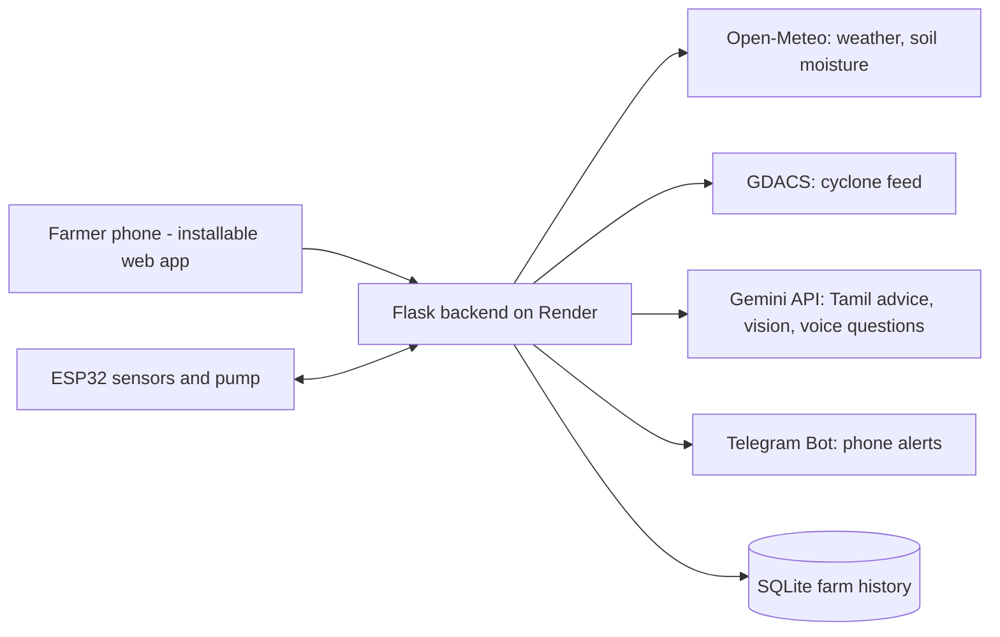

உங்கள் விவசாயி (Ungal Vivasaayi)
Tamil-first AI farm advisor for Cauvery delta paddy farmers. Built for Build with AI: Code for Communities 2.0, Track 4 (Agricultural Intelligence).
Live prototype: https://ungal-vivasaayi.onrender.com  (the free server may take about a minute to wake up)
Demo video: https://drive.google.com/file/d/1UTCGeTisQNqYUAR9si57G9OESyvKTE_J/view?usp=sharing
What it does
Live field data: weather, 3-day rain and wind (Open-Meteo), modelled soil moisture, cyclone proximity (GDACS). The farmer taps their field on a map.
Tamil advice with voice: Gemini turns the data into simple Tamil advice, read aloud. Farmers can ask questions by speaking.
Instant leaf diagnosis: photo in, Gemini Vision returns symptoms, confidence and organic treatment first. It always advises confirming with an agriculture officer.
Phone alerts: storm and heavy-rain warnings are sent through a Telegram bot, even when the app is closed.
Water map and pump: ESP32 soil sensors and a relay. Without sensors the app labels the map as a simulation and soil moisture as "modelled".
Farm history: advice, questions, diagnoses and alerts are saved (SQLite).
Architecture

Gemini prompts live in `app.py` (`advice`, `ask`, `diagnose`). If Gemini is busy the backend retries across several models, then falls back to simple rule-based advice and says so.
Run locally
```
python -m venv venv
venv\Scripts\activate          (Mac/Linux: source venv/bin/activate)
python -m pip install -r requirements.txt
python app.py
```
Open http://localhost:5000 and paste a free Gemini key (aistudio.google.com/apikey) in the box at the top.
Environment variables
`GEMINI_API_KEY`, `TELEGRAM_TOKEN`, `TELEGRAM_CHAT_ID`, optional `GEMINI_MODEL`. Never commit a `.env` file.
Deploy
Render web service. Build: `pip install -r requirements.txt`. Start: `gunicorn app:app --bind 0.0.0.0:$PORT --workers 1 --threads 4 --timeout 120`. See `DEPLOY.md`.
Hardware (optional)
`esp32_ungal_vivasaayi.ino`: 4 capacitive soil sensors and a relay. When sensors send data, soil moisture switches from "modelled" to "sensor".
Limits
Disease results are AI suggestions, not a diagnosis. Cyclone data depends on the public GDACS feed. The demo mode shows a fake storm and is clearly marked.
